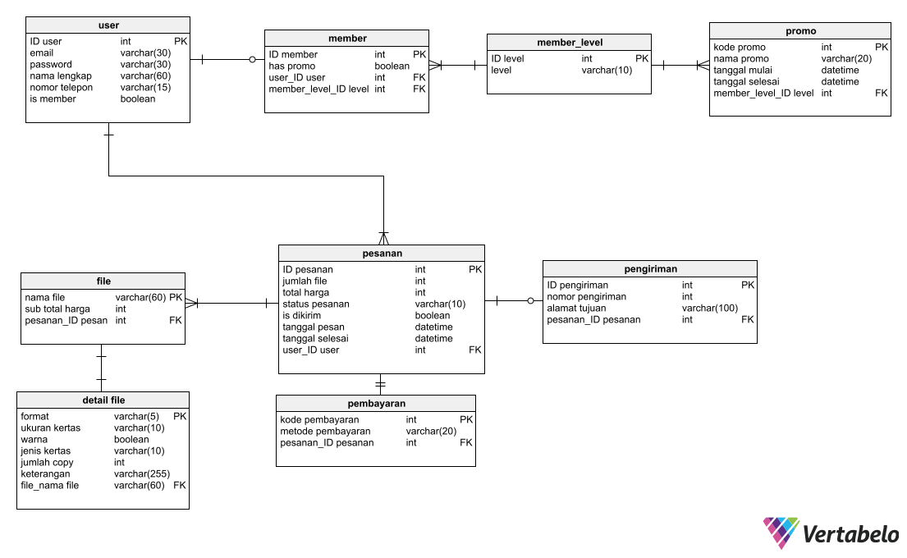

# Titiprint - Framework-Based Programming Course Final Project (Class E)

## Anggota Kelompok

<table>
    <tr>
	<th>Nama</th>
      	<th>NRP</th>
    </tr>
    <tr>
        <td>Hilmi Zharfan Rachmadi</td>
        <td>5025201268</td>
    </tr>
    <tr>
        <td>Muhammad Lintang Panjerino</td>
        <td>5025201045</td>
    </tr>
    <tr>
        <td>Hemakesha Ramadhani Heriqbaldi</td>
        <td>5025201209</td>
    </tr>
<table>

## Problem Statement

Di Indonesia, Usaha Mikro, Kecil, dan Menengah (UMKM) yang bergerak di bidang Digital Printing dan Fotocopy sangat marak kita temui. Pemesan jasa mereka juga amat banyak, terutama dari kalangan pelajar dan pekerja. Meskipun begitu, mayoritas UMKM Digital Printing dan Fotocopy belum memanfaatkan teknologi informasi untuk sistem pemesanan mereka. Ada beberapa tempat yang menyediakan pemesanan online, tetapi sistemnya kurang efisien dan rentan kesalahan. Pada umumnya, alur pemesanan online mereka adalah sebagai berikut:

- Customer mengontak pihak printing
- Pihak printing mengirimkan form pemesanan kepada customer
- Customer mengisi form pemesanan lalu mengirimkannya kembali kepada pihak printing

Yang menjadi masalah, alur ini biasa diimplementasikan melalui Email atau WhatsApp. Form pemesanan dikirimkan dalam bentuk teks, sehingga customer harus meng-copy paste atau mengetik ulang terlebih dahulu agar bisa mengisinya. Hal ini memperbesar potensi kesalahan ketik dan kesalahan format.

## Proposed Solution:

Oleh karena permasalahan di atas, kami mengusulkan aplikasi web TitiPrint yang menyediakan sistem pemesanan efisien antara pihak customer dengan suatu mitra UMKM Digital Printing dan Fotocopy. Pada website yang kami buat, diasumsikan bahwa terdapat satu pusat Digital Printing dan Fotocopy yang melayani banyak customer. Dengan adanya TitiPrint, diharapkan customer akan lebih terdorong untuk melakukan pesanan secara online di tempat Digital Printing dan Fotocopy, dan pihak mitra pun akan lebih mudah untuk mengelola pesanan-pesanan tersebut.

Berikut adalah CDM dan PDM dari Website Titiprint:

## CDM (Conceptual Data Model)

## PDM (Physical Data Model)

